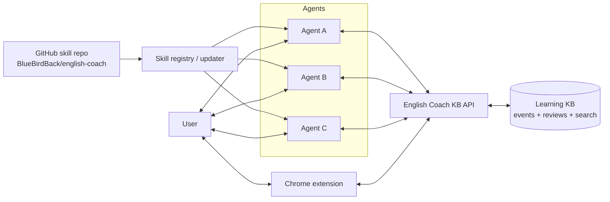

# Multi-agent Shared Learning Memory

## Decision

Multiple agents should not rely on private agent memory to share a learner's progress.

Use three separate layers:

```text
Skills        = shared behavior / procedure
Knowledge DB  = shared user progress and learning state
Agent memory  = small preference cache only
```

For English Coach, the learner's journey belongs to the learner, not to Agent A, Agent B, or one Hermes profile.

## Problem

If many agents install `BlueBirdBack/english-coach`, they need to answer two different questions:

1. **Skill freshness** — do I have the latest teaching procedure?
2. **Learner continuity** — what has this learner already seen, missed, reviewed, or mastered?

Those are different systems.

A skill update should change how agents teach.  
A learning-memory update should change what the learner sees next.

## Target architecture



## Skill update model

`english-coach/SKILL.md` is the canonical teaching behavior.

Each installed agent should track:

```text
skill_name: english-coach
source_repo: BlueBirdBack/english-coach
installed_version: 0.x.y
installed_commit: <git sha>
last_checked_at: <timestamp>
```

Update paths:

```text
Manual:   hermes skills check && hermes skills update
Cron:     scheduled update check per profile/host
Webhook:  GitHub release/push event → notify/update agents
```

Important rule:

```text
Running sessions do not assume live skill reload.
Skill updates take effect on new session, /reset, or gateway restart.
```

## Learning-memory model

Every teaching interaction appends events to a shared KB.

Example event:

```json
{
  "learner_id": "telegram:<user-id>",
  "agent_id": "ash-23",
  "skill": "english-coach",
  "skill_version": "0.3.1",
  "event_type": "term_seen",
  "term": "plausible",
  "context": "The story sounds plausible.",
  "source": "telegram",
  "timestamp": "2026-04-28T12:00:00+08:00"
}
```

Agent A may teach `plausible`.  
Agent B may teach `resilience`.  
Both write to the same learner record, so the next agent can see both.

## Minimal database shape

```text
learners
  id
  display_name
  native_language
  target_language
  level_estimate
  preferences

terms
  id
  normalized_term
  language
  cefr
  ipa
  meaning

encounters
  id
  learner_id
  term_id
  agent_id
  skill_version
  source
  context
  created_at

corrections
  id
  learner_id
  original_text
  corrected_text
  issue_tags
  explanation
  created_at

review_cards
  id
  learner_id
  term_id
  state
  due_at
  stability
  difficulty
  seen_count
  mistake_count

review_events
  id
  learner_id
  card_id
  rating
  response
  reviewed_at

agent_runs
  id
  agent_id
  learner_id
  skill_name
  skill_version
  input_ref
  output_ref
  created_at

skill_versions
  skill_name
  version
  git_sha
  released_at
```

## Retrieval before answering

Before an English Coach agent answers, it should load a compact learner context:

```text
learner level
known terms
weak terms
due reviews
recent corrections
repeated mistake patterns
preferred examples/style
```

Then it can answer with continuity without bloating the LLM context.

## Chrome extension role

The Chrome extension should be a UI/client, not the source of truth.

```text
Hermes agents ──read/write──> English Coach KB/API <──read/write── Chrome extension
```

Useful extension features:

- Select text on any webpage → explain, save, or practice.
- Sidebar search across saved terms, corrections, examples, and reviews.
- “Seen before?” indicator for words on the current page.
- Review-due list.
- Page-context capture: URL, title, sentence, timestamp.
- One-click ask: send selected text to English Coach with learner context.

## Search model

Use both exact and semantic search:

```text
Full-text search:
  terms, contexts, corrections, source titles

Vector search:
  similar examples, repeated mistake patterns, related phrases

Filters:
  due today, weak terms, B2+, from current site, corrected before
```

## Spaced repetition

Review scheduling should be centralized.

Good enough MVP:

```text
SM-2-style scheduler
```

Better later:

```text
FSRS-style scheduler
```

Agents should not each maintain their own repetition queue. They should ask the KB:

```text
What is due for this learner now?
What weak terms should appear naturally in today's examples?
What mistakes should I watch for?
```

## Privacy and permissions

Learning memory can contain personal writing, browsing context, and mistakes. Treat it as sensitive.

Rules:

- Store learner data per user, not globally.
- Keep raw private text out of public logs.
- Let the user delete terms, events, or all history.
- Avoid sending sensitive/private text to external TTS or image tools by default.
- Record which agent wrote each event.
- Record which skill version produced each explanation or correction.

## MVP

Build the smallest useful version:

1. Shared KB API with SQLite/Postgres.
2. Event append endpoint.
3. Learner context endpoint.
4. Search endpoint.
5. Review-due endpoint.
6. Chrome side panel for search + save selected text.
7. Hermes English Coach wrapper that reads/writes the KB.

Demo line:

```text
Multiple English Coach agents, one learner memory.
```

## AskClaw relevance

This is not just an English-learning feature.

It is the same architecture AskClaw needs for one-person-company work:

```text
many agents
one human
shared project memory
shared progress
auditable events
small useful interfaces
```

English Coach is a clean demo domain because progress is visible: words seen, mistakes fixed, reviews due, and improvement over time.

See also: [Knowledge base source analysis](../research/knowledge-base-source-analysis.md).
